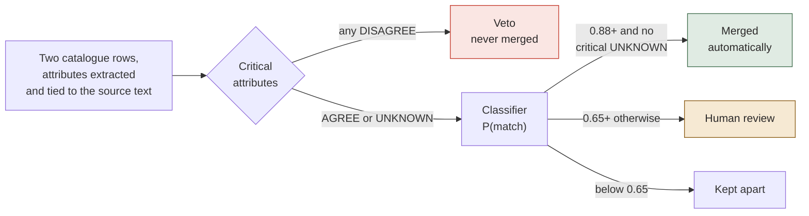
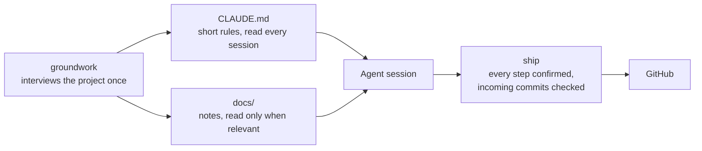
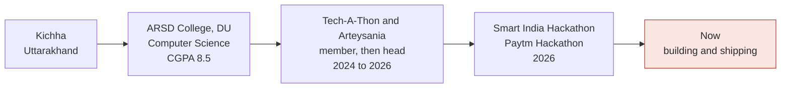

<a href="https://divyanshjoshi.in">
  <picture>
    <source media="(prefers-color-scheme: dark)" srcset="assets/header-dark.svg">
    <source media="(prefers-color-scheme: light)" srcset="assets/header-light.svg">
    
  </picture>
</a>

  
  

I study Computer Science at Atma Ram Sanatan Dharma College, University of Delhi (class of 2028), and I live in Gurugram. I build applied AI systems. The part I care about most is evaluation: finding out whether a model is right before anyone depends on it, and saying so plainly when the evidence isn't there.

Most of what I've built sits in private repositories for now, so this profile shows less than exists. Each project below says why its code is private and where you can read about it instead. The full case studies are on [divyanshjoshi.in](https://divyanshjoshi.in), along with an illustrated desk you can click around.

## What I'm building

| Project | What it does | Status | Where to look |
|---|---|---|---|
| AIKYA | Matches the same physical item across public-sector SAP catalogues, and refuses any merge it can't justify. | In progress | [Case study](https://divyanshjoshi.in/projects/aikya). Code private until the hackathon evaluation. |
| Weprax | Helps a person review code they didn't write, including code an AI assistant wrote. | In progress | [Overview](https://divyanshjoshi.in/projects/weprax). Code private pending patent review. |
| Workout Tracker | A mobile-first PWA for logging gym sessions, in daily use. | Shipped | [Live app](https://workout-tracker-tawny-mu.vercel.app) · [code](https://github.com/divyanshjoshii/workout-tracker) |
| ship and groundwork | Two Claude Code skills that keep a coding agent predictable from one session to the next. | Shipped | [groundwork](https://github.com/divyanshjoshii/groundwork) · [ship](https://github.com/divyanshjoshii/ship) |

## Stack

Everything here is used in one of the projects above. Nothing is listed on the strength of a course or a tutorial.

| Area | Tools |
|---|---|
| Languages |     |
| AI and ML |   plus evaluation design and context engineering |
| Backend |     |
| Frontend |    |
| Tooling |     |

I'm learning Rust, RAG with vector retrieval, and knowledge graphs. None of them is in a shipped project yet. Hybrid retrieval is the next planned change to AIKYA, because its candidate search is lexical today and an item described in different words never reaches the classifier.

## How AIKYA decides two parts are the same

AIKYA started as Smart India Hackathon problem statement SIH26099. Every public-sector enterprise runs its own SAP material master, so one bolt ends up with a different code, description and unit at each company. AIKYA works out which rows are the same item and gives them one national code.

SS304 and SS316 bolts differ by one character, and any string metric scores them about 97% similar. They are different materials. SS316 contains molybdenum and is specified for chloride service, so merging the two codes puts the wrong bolt on a seawater line. AIKYA checks the attributes that matter for safety before the similarity score gets a say.

The match decision is a gradient-boosted classifier, not an LLM, so the same pair gets the same answer years later and every decision can be audited.

Accuracy comes from 5-fold cross-validation, grouped by cluster so two spellings of the same item never land on opposite sides of a split. Splitting pairs at random would leak the answer into training.

| Matcher | Precision | Recall | Hard negatives merged |
|---|---|---|---|
| Naive fuzzy similarity | 61.0% | 82.2% | 1,854 of 2,562 |
| AIKYA, merging on its own | 100% | 54.1% | 0 of 438 |
| AIKYA, with the review queue | 98.2% | 98.2% | 73 sent to a person |

Read the last two rows together. Everything AIKYA merges on its own is correct, and the pairs it isn't sure about go to a person. The baseline is scored on every pair, while AIKYA is scored only on pairs held out of training, which is why the two denominators differ.

The benchmark is synthetic: 2,017 labelled materials across 6 CPSEs, generated so that precision and recall can be quoted at all. It is not real CPSE data.

## How I work with coding agents

An agent is only as reliable as what it's told and what it's allowed to do. I wrote two Claude Code skills for my own workflow, composed from existing skills, to handle both.

Keeping the always-read file short matters because everything in it costs attention on every turn. The notes stay out of the way until a task needs them.

## Where I've been

## Get in touch

The quickest route is the Hire me button on [divyanshjoshi.in](https://divyanshjoshi.in), which opens an email to me. I'm also on [LinkedIn](https://www.linkedin.com/in/diivyanshjoshi/).
