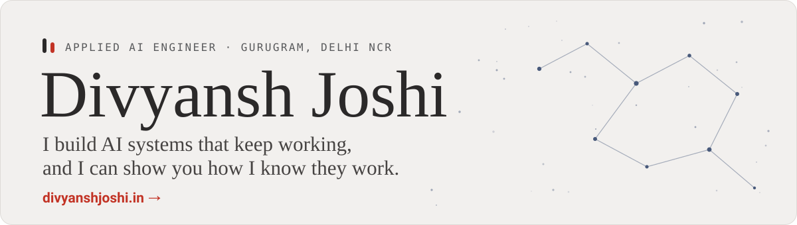

<a href="https://divyanshjoshi.in">
  <picture>
    <source media="(prefers-color-scheme: dark)" srcset="assets/header-dark.svg">
    <source media="(prefers-color-scheme: light)" srcset="assets/header-light.svg">
    
  </picture>
</a>

I study Computer Science at Atma Ram Sanatan Dharma College, University of Delhi, and I live in Gurugram. I want to work as an applied AI engineer, building LLM products that still hold up once real people depend on them. Most of my work is in Python and TypeScript, with FastAPI and scikit-learn on the backend and Next.js and React on the front. The part I care about most is evaluation: finding out whether a model is right before anyone relies on it.

## What I work with

<picture>
  <source media="(prefers-color-scheme: dark)" srcset="https://skillicons.dev/icons?i=python,ts,js,fastapi,sklearn,postgres,sqlite,docker,nextjs,react,tailwind,git,githubactions,vercel&perline=7&theme=dark">
  
</picture>

## Learning next

<picture>
  <source media="(prefers-color-scheme: dark)" srcset="https://skillicons.dev/icons?i=rust&theme=dark">
  
</picture>

Rust, plus RAG with vector retrieval and knowledge graphs.
